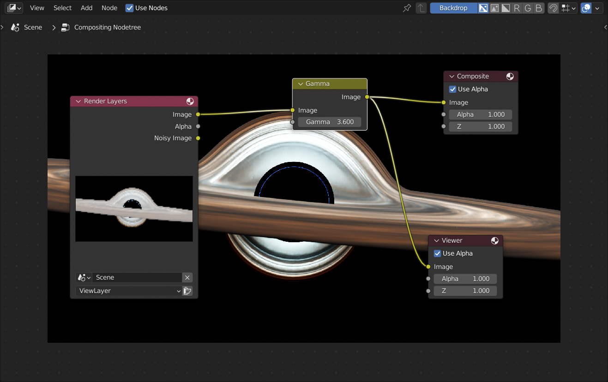

Pimping a black hole
==========

I worked through Iridesium's "Create a Black Hole in Blender" [tutorial](https://www.youtube.com/watch?v=5naMFeWTBeY) on YouTube. Despite following it very closely, my result, while interesting, looked very washed out compared with the amazing renders in the tutorial. It turns out that the final brief comment about compositing is crucial:

> I would really recommend doing some compositing when you're done. Compositing is really important and you should get good at it just because it can really take your image to the next level.

I haven't been using Blender long and haven't paid much attention to details like the _View Transform_ (typically _Filmic_) or applying any transformations to my final render in the _Compositing_ workspace. But here, a trivial amount of work in the _Compositing_ workspace makes all the difference. Just compare these results:

### Original render

### Render with compositing gamma 2.6

### Render with compositing gamma 3.6

The original image looks flat and washed out. I'd heard this being said before about _Filmic_ (if you've never seen this term before, go to _Output_ properties, expand the _Color Management_ section and you'll see it there in the _View Transform_ field). It takes a lot of reading to find out why these apparently negative characteristics (flat and washed out) are actually highly desirable and that you're actively expected to use _Compositing_ to transform the render of your 3D model into a final result.

But let's leave the "why" aside for the moment and look at how simple it is to achieve something far nicer than the original render with just one additional node.

Compositing
-----------

Here's my [`black-hole.blend`](https://github.com/george-hawkins/black-hole/raw/master/blend-files/black-hole.blend) (created with Blender 3.0). Open it (or your own version of the black hole) in Blender and then go to _Compositing_ workspace and tick _Use Nodes_. You should see something like this:

Two important things, the _Backdrop_ button should be enabled (which it is by default) and you need to have the _Node Wrangler_ add-on enabled (it's bundled with Blender, you just have to go to _Preferences / Add-ons_, search for _Node Wrangler_ and tick it to enable it).

Aside: _Node Wrangler_ isn't essential but it just makes life much easier.

For the moment, the _Render Layers_ node is empty. We have to do a render before it shows anything so press `F12` and wait for the render to complete. The black hole takes about 80 minutes to render on my machine and the _Render Layers_ node always becomes empty when you reopen a `.blend` file. Having to redo your render each time you start working with a `.blend` file again quickly becomes tiresome - there's a solution to this that's covered later.

If you're impatient then go to _Render_ properties and for the moment set the _Time Limit_ to e.g. 60s or however long you're prepared to wait.

Once your render is complete, just close the render window - don't worry, Blender will remember the result. Now, hold down `Ctrl` and `Shift` and click the _Render Layers_ node. This is _Node Wrangler_ magic - it adds a _Viewer_ node and connects it to the _Render Layers_ node (you could of course do this by hand). The result should be that you see the following node setup with your render as the backdrop:

Now, the magic. For a super quick but dramatic improvement to the result, press `Shift-A`, go to _Color_ and select _Gamma_. Wire up the _Gamma_ node between the _Render Layers_ node and the _Composite_ node and then `ctrl-shift` click it to connect it to the _Viewer_ node. Change the gamma value from 1.0 to 3.6 and you end up with this:

Try adjusting the gamma value until you get a result you like - you'll immediately see how your changes affect things in the backdrop.

Bizarrely, despite Blender having the underlying render layer result and being able to display the results of your tweaks instantly in the backdrop, if you now press `F12` to produce a final result, it will re-render everything from scratch.

There is a way around this (see below) but it feels like things should be much simpler - the obvious thing would be to be able to disable re-rendering in the _Rendering Layers_ node. If you like this idea, you can vote for it [here](https://blender.community/c/rightclickselect/4nfbbc).

Using the Color Balance node
----------------------------

I used the _Gamma_ node above because it's a super quick way to get a much more interesting result. With the black hole, there's no such thing as "realistic" colors, all we're interested in is getting an appealing result. However, after some reading, I get the impression that the _Color Balance_ node with its _Correction Formula_ set to _Offset/Power/Slope_ should be your go-to node for this kind of thing, especially when realism and proper control of the color are more important to you. However, unlike _Gamma_, there isn't one magic number that improves everything - you have to learn what the _Basis_ field and the _Offset_, _Power_ and _Slope_ color pickers do. This isn't something one can explain in one or two simple sentences.

Let's just add it with `shift-A` and _Color / Color Balance_ and replace the _Gamma_ with it. Below, I've set the _Basis_ to -0.1, dragged the _Slope_ down a little and increased the _Power_:

See the _ASC-CDL_ in the _Correction Formula_ field above? This is the technical name for the protocol involved here, to find out more about ASC-CDL and how _Basis_ etc. work see this [answer](https://blender.stackexchange.com/a/55239/124535) on the Blender StackExchange. It's not particularly simple but with a little playing around it should become clear what's going on.

Scopes
------

This step is just a fun extra and not essential to this whole process. If you split the area containing the _Compositor_, switch the _Editor Type_ in the new left-hand area to _Image Editor_, click the _Browse Image_ icon, select _Render Result_, then press `N` to pop out the sidebar and switch to the _Scopes_ tab, you'll see something like this:

If you reduce down the size of the _Image_ editor area so that you just see the scopes to the left of the _Compositor_ then you've now got a nice additional way to see the result of changes you make in the _Color Balance_ node:

The nature of this particular render means that you won't actually see much in anything other than the _Waveform_ scope (I did initially wonder if the others were working but if you tweak the values in the _Color Balance_ node dramatically, you'll see that the issue is that nearly everything is actually bunched up on the left-hand side of the _Histogram_ scope).

Avoiding re-rendering
---------------------

As noted above, you have to re-render each time you re-open your `.blend` file, if you want to then work with the render in the _Compositing_ workspace. This is extremely inconvenient. The solution is to treat the rendering of your 3D model and the composting as completely separate projects and manage them in separate `.blend` files. This sounds inconvenient but in a way it makes sense - your underlying render is some kind of base truth, i.e. the as yet unaltered fundamentals. You should generate and save the output of this process and then always have it available as the input for the process of composting a result with particular tweaks and effects applied. If you try to do everything in one project then you bake the results of your tweaks etc. directly into your output which isn't desirable.

But let's not argue about whether this all makes sense and just look at a solution.

Instead of switching to the _Compositing_ workspace, at the end of creating your black hole, just press `F12` to generate a render. This will be the same washed-out result that led us to all of the above but this time we're going to do something different with it.

Aside: if you went through the compositing steps described up above then just delete the _Color Balance_ or _Gamma_ node and reconnect the _Image_ output of the _Render Layers_ node to the _Image_ input of the _Composite_ node, in order to get back to the original state, and then re-render.

When the render is complete, go to _Image / Save As_ and switch the _File Format_ from the usual _PNG_ to _OpenEXR_:

Unlike a _PNG_, the _OpenEXR_ file can capture all the data from our render such that we have full flexibility when it comes to applying changes to it later. For more about _OpenEXR_, see the Wikipedia [article](https://en.wikipedia.org/wiki/OpenEXR).

If you haven't got an _OpenEXR_ viewer, you can use the [OpenHDR Viewer](https://viewer.openhdr.org/) website to look at your file:

When you've uploaded your file, drag the upper-right slider and press the _Exposure_ button to see other options and experiment with things.

OK - that's us done with `.blend` file for our 3D model! The only reason to go back to it now is if you want to change your model in some way or create different views of it, which you then save out as additional _OpenEXR_ files.

Now, open a new Blender project, i.e. just go to _New / General_ and go straight to the _Compositing_ workspace. Tick _Use Nodes_ as before but this time we're going to do something a little unusual, select the _Render Layer_ node and delete it (make sure the _Composite_ node isn't also selected). Now, press `Shift-A`, go to _Input_, select _Image_, wire it up to the _Composite_ node and `ctrl-shift` click it so that it's also wired up to a _Viewer_ node:

Now, click open and select the _OpenEXR_ file that you saved previously. You end up with a very similar situation as before but with an _Image_ node rather than a _Render Layer_ node:

Note: the _Color Space_ value defaults to _Linear_ - this is the correct value for our render. If we were working with a photo or a video sequence, we'd have to specify something else.

Now, you can add in a _Color Balance_ node as before:

So far everything looks very similar to the previous setup. However, if you now press `F12` to render your result, it should happen almost instantaneously. It no longer does the highly expensive initial render of the underlying 3D model - that's already been captured in the _OpenEXR_ file.

If you want to see my `.blend` file for the above, you can find it here in [`black-hole-exr.blend`](https://github.com/george-hawkins/black-hole/raw/master/blend-files/black-hole-exr.blend) (with the OpenEXR file packed into the `.blend` file for convenience). Remember, you have to switch to the _Compositing_ workspace to see anything and you'll have to press `F12` to do an initial render (but it will be super quick as it's working off the _OpenEXR_ file).

Conclusions
-----------

Thank you very much if you've read this far. I hope you found some of the above useful (if you did then maybe star the repo to feed my vanity). If you've got any suggestions or corrections then create an [issue](https://github.com/george-hawkins/black-hole/issues). I'd love to hear from you but I apologize in advance if you don't hear back from me - I've got very little free time at the moment.

I'm really sorry but if you've got questions about any aspect of this then please ask them on the [Blender StackExchange](https://blender.stackexchange.com/) or on [Blender Artists](https://blenderartists.org/) as I'm simply not in a position, time-wise, to help you out. And I am just a Blender beginner too.